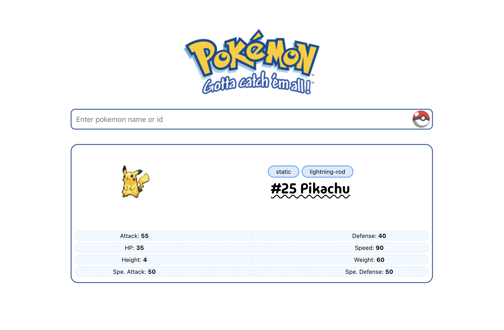

# Pokemon Finder App

A simple Flask app to search for Pokémon details using the PokeAPI.



## How it works

- Go to `/pokemon` to search for a Pokémon by name.
- It shows info like type, abilities, and stats.

## To-Do App

- Go to `/todo` to use a basic to-do list.
- You can add and delete tasks.

## Setup

1. Install Python 3 and pip.
2. Clone this repo.
3. Run:

```bash
pip install -r requirements.txt
python app.py
```

4. Open `http://localhost:5000` in your browser.

## Notes

- This app has two parts: `/` and `/todo`.
- Built with Flask and uses HTML + CSS.
